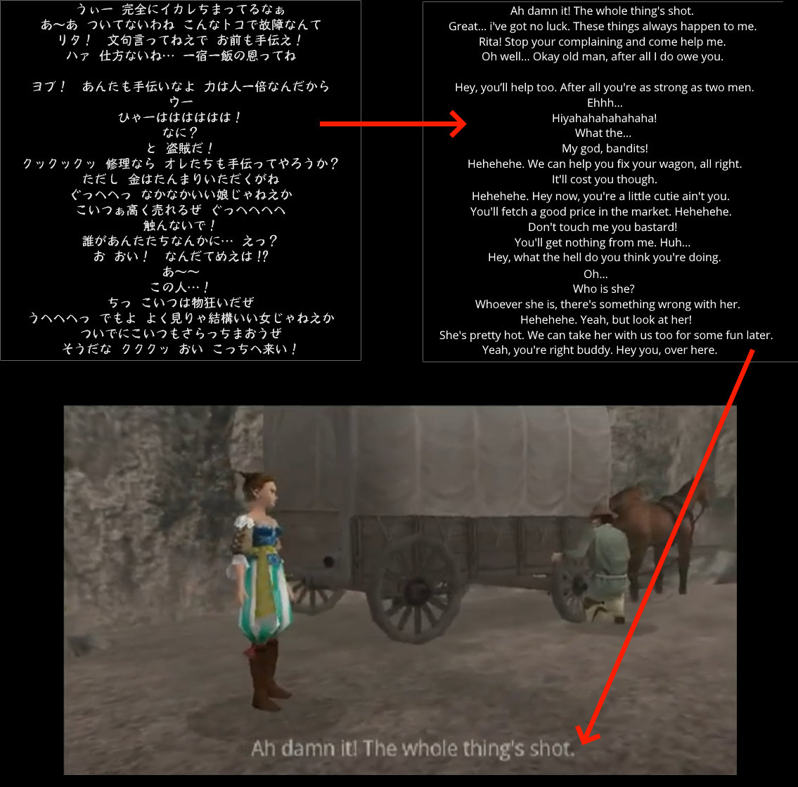

# DC Berserk Texture Tool
**Sword of the Berserk: Guts' Rage - TEX File Packer/Unpacker - Sega Dreamcast**

This tool allows to extract and repack all *.TEX files from the gameSword of the Berserk: Guts' Rage.

How to use?
* Download the tool. (You can find it under the releases tab [here](https://github.com/derplayer/DCBerserkTextureTool/releases))
* Start the tool and select the extracted "TEXTURES" folder from the game image.
* The tool will unpack all files inside the *.TEX files and convert those to *.PVR
* You can freely edit them, just dont move or rename them.
* Also dont change the Compression and Image type of the PVR. (Always re-encode it with the same settings, for subtiles it is always VECTOR_QUANTIZATION and ARGB4444)
* When you are done just press the "Repack" button in the Tool. All changes from the PVR files will be reapplied to the TEX file.

### Video Undub Proof of Concept (JPN Voice, ENG subtitles)

### Video Undub Proof of Concept (ENG Voice, ENG subtitles)

